# Language Phylogenies Practical:

----
**Simon J. Greenhill** (<simon@simon.net.nz>).
- ARC Centre of Excellence for the Dynamics of Language, Australian National University.
- Department of Linguistic and Cultural Evolution, Max Planck Institute for the Science of Human History.
----

# 1. Basic Phylogenetics:

Here is a table of cognates from some Polynesian languages. The colored blocks denote cognate words.

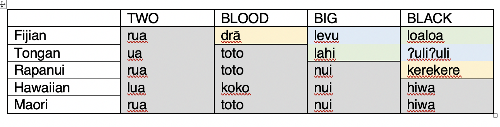

## Maximum Parsimony (MP):

Let's build a tree from these data using Maximum Parsimony. To do this, we need a matrix of cognate sets coded as “1” for Present or “0” for Absent in each language. For example, "blood" contains a yellow cognate set, and a gray cognate set which we can code like this (Blood.1 is the yellow cognate set, Blood.2 is the gray):

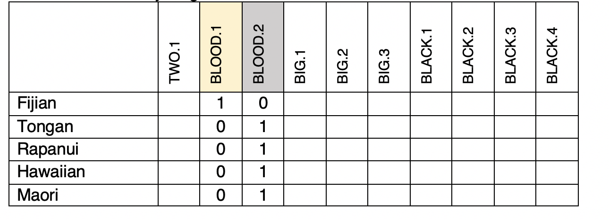

``[ ] Fill in the rest``


Here are two trees. Let's draw the above cognate sets on the trees. The yellow Blood.1 set is only present in Fijian, so it must have been innovated somewhere in that lineage after Fijian split from the rest. The gray Blood.2 set is present in all the other languages, so must have originated in the branch separating Fijian from the rest:

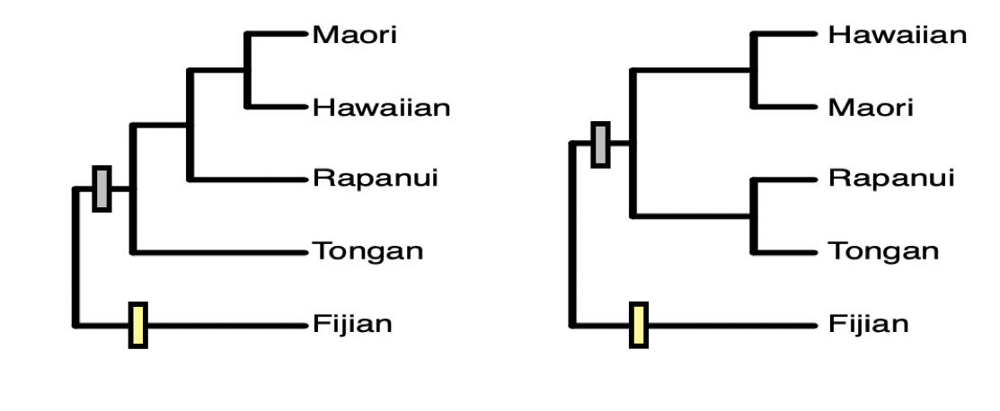

``[ ] Can you do the others?``


Remember that MP measures how well a tree explains the data by aiming to find the tree with the fewest number of changes (i.e. the “shortest” tree length). 

``[ ] What is the length of tree 1 (i.e., number of changes)?``

``[ ] What is the length of tree 2 (i.e., number of changes)?``

``[ ] What is the best fitting – most parsimonious – tree?``

 
Now that we know which tree is the best fitting, we can answer the following (focus only on the best tree, ignore the bad one): 

``[ ] What cognate sets innovated in Proto-Central Polynesian (i.e. the ancestor of Hawaiian & Maori).``

``[ ] Which language has the most change from Proto-Central Pacific?``

## Maximum Likelihood (ML):

ML is a more advanced approach than MP. ML aims to calculate the likelihood of the data on a tree using a model of language change. The likelihood is a numeric value that’s proportional to the fit of the data on the tree. This will be a very small number (since it’s the outcome of multiplying lots of probabilities together), and is usually reported as a Log Likelihood (LnL). Values closer to zero fit the data the best. Using a simple model of cognate gain and loss, the log likelihood of tree 1 above is -12.007, and the log likelihood of tree 2 is -14.805.

``[ ] Which fits better?``


# 2. Phylogenetic Data Formats:

The most common file format you'll encounter in phylogenetics is a _nexus_ file. The filename will usually end in .nex or .trees. Nexus is a very simple text format, that starts with "#NEXUS", and then contains a series of one or more 'blocks'. The blocks start with "BEGIN" ... and terminates with "END". Here is what the matrix we built above looks like as a nexus file:

```
#NEXUS

BEGIN DATA;

DIMENSIONS NTAX=5 NCHAR=3;
FORMAT MISSING=? GAP=- DATATYPE=BINARY;

MATRIX 
Fijian		0	1	1	0	1	0	0	1	0	0	0
Tongan		0	1	0	1	0	1	0	0	1	0	0
Rapanui		0	1	0	1	0	0	1	0	0	1	0
Hawaiian	0	1	0	1	0	0	1	0	0	0	1
Maori		0	1	0	1	0	0	1	0	0	0	1
END;
```

Note that the very first column of the matrix is all zero. We need this because of the way `BEAST` implements a correction for `Ascertainment Bias` (See the section on `Ascertainment Correction` in the appendix). The next columns are our data.

If you want to generate a dataset for your own analysis, you need to create a  data file. Programs like `Mesquite` (<http://mesquiteproject.org/>) provide an interface that might be helpful. Or you could use `Excel` to layout the matrix part, and then cut and paste into a text file to add the extra stuff. Or tools like `lingpy` (<https://lingpy.org>) can generate nexus files from tab-delimited text files. 


# 3. Exploring our data. 

A good way to visualise our data is a `Neighbor-Net` network. This shows the conflicting signal in the data using a `splits graph`. Here, bigger boxes mean more conflict, longer lines means more signal in the data supporting that 'split'. You can make your own in a program called SplitsTree (www.splitstree.org), but I've made it here for you as you need to register (for free) to use SplitsTree. 

Here's the Neighbor Net Network of our data:

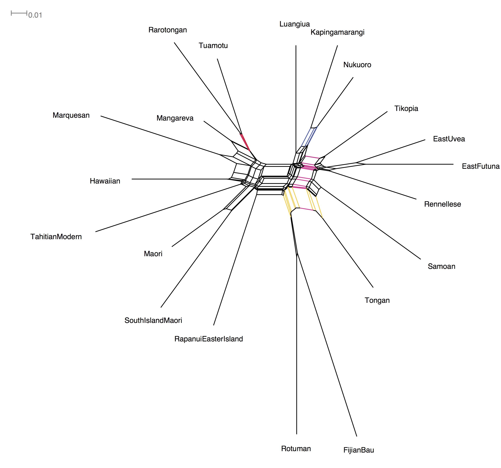

To read Neighbor Nets, look for the parallel lines as these represent the groupings in our data. I've colored a few of them to show you the groups. 

1. The biggest split is right down the middle, and corresponds to the East and West Polynesian language groups.

2. A nice 'tree-like' split with little conflict looks like the tiny box grouping. A good example of this is the _red_ split that groups Rarotongan and Tuamotu with each other against everything else.

3. A slightly more conflicting group is the _blue_ split that groups Fijian's Bau variety with Rotuman (a notorious example of language contact, Biggs 1965).

4. There's a really big conflicting split for Tongan. You can see that the _yellow_ splits place it with Rotuman and Fijian, while the _pink_ split places Tongan with the Samoic-Outlier languages (e.g. Tikopia, East Uvea, East Futuna, Samoan). This might be an outcome of Tongan influencing the Samoic-Outlier languages during the Tongan Empire period <https://en.wikipedia.org/wiki/Tu%CA%BBi_Tonga_Empire>.

Overall this is quite a messy dataset, so it should be fun to see what we can do with trees.

----


# 4. BEAST 2:


`BEAST 2` (Bouckaert et al. '14) is one of the most powerful Bayesian Phylogenetic analysis suites around:

> BEAST 2 is a cross-platform program for Bayesian phylogenetic analysis of molecular sequences. 
> 
> It estimates rooted, time-measured phylogenies using strict or relaxed molecular clock models. It can be used as a method of reconstructing phylogenies but is also a framework for testing evolutionary hypotheses without conditioning on a single tree topology. 
> 
> BEAST 2 uses Markov chain Monte Carlo (MCMC) to average over tree space, so that each tree is weighted proportional to its posterior probability. 
> 
> BEAST 2 includes a graphical user-interface for setting up standard analyses and a suit of programs for analysing the results.

## Our workflow:

1. Set up analysis in `BEAUTi`. `BEAUTi` is a graphical user interface that will generate files in the XML format that `BEAST` wants.
2. Run the generated XML file in `BEAST`. 
3. Examine the analysis log files using `Tracer`
4. Construct summary tree using `TreeAnnotator` and visualise the results using `FigTree` and `Densitree`.

## Install packages we need in BEAUTi.

`BEAST` has a package system where new packages can add in extra functionality. This is where all the cool new `BEAST` add-ins appear. 
Today we want to install some templates in the `Babel` package that will help us analyse language data.

1. Open `BEAUTi`. It will be where-ever you installed `BEAST`. It looks like this, showing you the default `Partitions` tab:

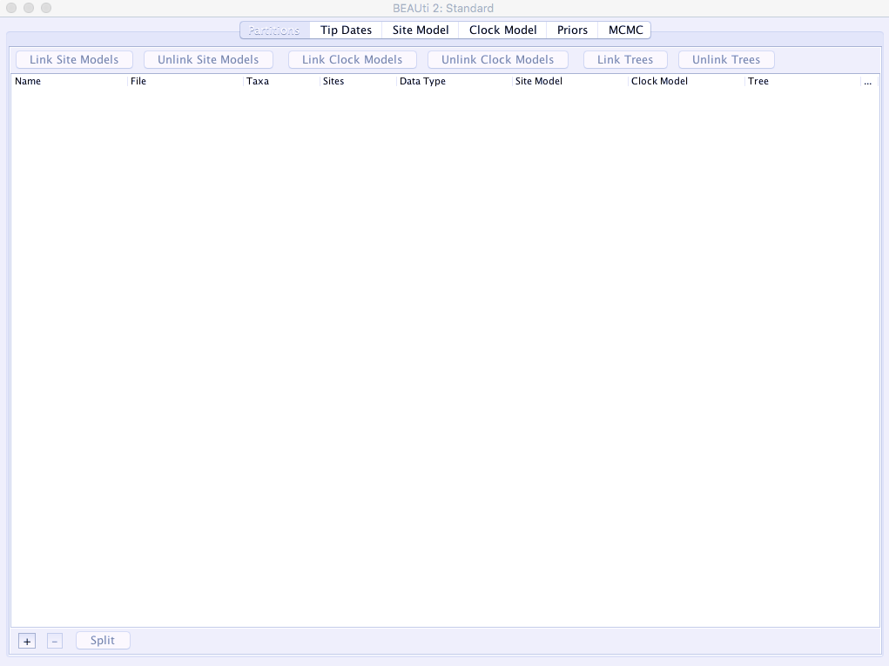 

2\. From the _File_ menu select _Manage Packages_:

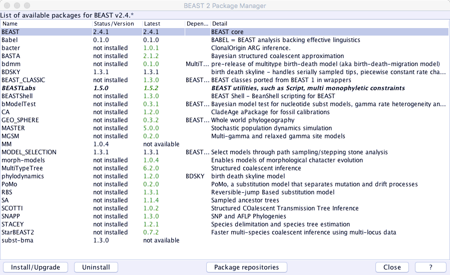 

3\. `Babel` is so new it's not in the general repositories. So, click the _Package Repositories_ button down the bottom. Select _Add URL_ and enter the following:
	
	https://raw.githubusercontent.com/CompEvol/CBAN/master/packages-extra.xml

... you should now have something like:


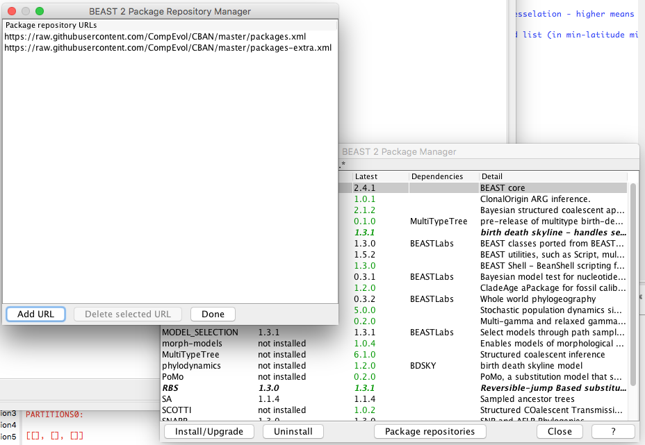 

Click _DONE_ and then you should see `Babel` in the add-ons list. Select it and click _Install/Upgrade_. This should work. 

4\. Close BEAUTi and Restart it (to make sure the package contents are loaded).  

``[ ] Add the New Package URL.``

``[ ] Make sure you have the Babel package installed.``

## Set up Analysis.

We're going to set up a very simple analysis using the dataset from before (cpacific.nex). We will run one of the simplest possible analyses to explore the data. 

Here we're using a Continuous Time Markov Chain Model (CTMC) for binary data. It is essentially the Generalised Time Reversible Model (Tavaré '86) for binary data (Drummond & Bouckaert '15). The CTMC allows cognates to be gained and lost at the same rate, which is probably not correct, but it's simple, and we can try a different model later.

1. Open `BEAUTi`. 
2. Select a template:
        `File -> Template -> BinaryCTMC`
3. Add Data:
        `File -> Add Alignment -> (Choose your file)`

You should see the dataset listed as something like "bin.cpacific" on the `Partitions` tab. Check that BEAUTi shows the same number of taxa and sites (=characters) that are in the nexus file, and that the data are identified as `binary`. 

``[ ] Data are loaded into BEAUTi.``


### Site Model Tab.

Select the `Site Model` Tab. Here we specify the "site model", i.e. the model that describes how the characters in our data will evolve.

Using the `Babel` template for `BinaryCTMC` has set up a `CTMC` model for us.

### Clock Model Tab.

Select the `Clock Model` tab. This allows us to specify the clock model that describes how the branches in the tree vary in rates. We have two main options.

A. `Strict Clock`: There are no variations in rates across branches. 

B. `Relaxed Clock (Log Normal)`. Variation across branches is autocorrelated, so that neighboring branches can be more similar than those further away (Drummond et al. '06). This allows different lineages to vary but that variation to get larger as languages get more different. Note that the Relaxed Clock can also be parameterised with an exponential distribution, but the Log Normal parameterisation is better (Drummond et al. '06).

We have strong prior beliefs for choosing the `Relaxed Clock` as we know that languages vary in their rates of change. But, remember that we are setting up the simplest analysis and we want to test whether we need to "relax the clock" or not later. So, leave it as the Strict Clock for now.

### Priors Tab.

Here's where things get fun.

Remember that BEAST is completely Bayesian, this means we can add other information into the analysis from our 'prior' beliefs. We can use this to
make strong or weak assumptions about pretty much anything in the analysis from the way the trees should look, to the way that any of the other parameters should vary or be constrained, to how the taxa in our analysis should be related. 

### Choose a Tree Prior:

The Tree Prior describes the process that generates the tree. Here we should set it to a `Yule` process. This is a very simple "pure birth" process which starts with one lineage, waits for some amount of time then splits that lineage into two, and then repeats until we've got a tree (Yule '24). At any given time slice there's a constant probability of a lineage split at any time, and in every slice each lineage has an equal chance of splitting.

The Yule is a simple general tree prior to use, unless you have extinct languages in your analysis. If this is the case then you will need to use something more complicated like the a `Birth-Death Skyline` or `Sampled Ancestor` (if you have extinct languages and their descendants (e.g. Latin + French, Italian). These are harder to run and stabilise however, so we will stick with the Yule for now.

### Adding Calibrations:

The main thing we use the prior tab for is to add calibration information. Fortunately, we have good archaeological information about the settlement of Polynesia.

#### 1. New Zealand. 

According to Wilmshurst et al. ('11), the settlement of New Zealand can be securely dated to between 1230-1282 A.D. We have two dialects of NZ Maori in these data: Maori and SouthIslandMaori. Let's operationalise this calibration like this: If we assume that the `present` is a nice round number like the year 2000 (this makes interpretation easier), then we convert this to before present:

    2000 - 1230 = 770 years ago
    2000 - 1282 = 718 years ago
        
... a good shape for this distribution is a `log normal` as it will allow the lower bound to be tighter than the other side. That is, I'm pretty confident that settlement didn't occur more  recently than 718 years, but settlement could have occurred earlier than 770 years ago and language divergence may have slightly preceded that date. 

1. click the `+ Add Prior` button and choose `MRCA Prior` (where MRCA means "Most Recent Common Ancestor").
2. When the dialog pops up, enter `NewZealand` into the field `Taxon set label`.
3. Find Maori and S.I. Maori and move them to the right side of the window.
4. Click OK.

``[ ] Done that.``

Next we'll define the prior probability distribution:

1. Click the little arrow to the left of that new prior. This will open up a little sub-menu.
2. Select the check box called `monophyletic`. This will enforce this subgrouping in the analysis. It's a good idea to do this for each calibration, but you should check first that the languages do subgroup correctly.
3. Where it says `[none]`, change that to `Log Normal`. 

Now we can specify the age range for this subgroup. We want to get the left side of the distribution (the 2.5% quantile) near the earliest age of 718, and have the _median_ sitting around the oldest age of 770. 

1. tick the box that says `Mean in Real Space` (if you can't think in log units, this will make your life easier).
2. Set the value for M to 90.
3. Set the value for S to 0.8 (this flattens the distribution a bit.
4. Set the offset to 704.

I got these values by fiddling around a bit to get the distribution to look something like our interpretation of this archaeological evidence.

This calibration tells BEAST that we expect the origin of this subgroup to have been somewhere between 718-1000 years ago with a peak around 770 years. Any trees that the MCMC search finds that places this group outside this age range is therefore heavily penalised.

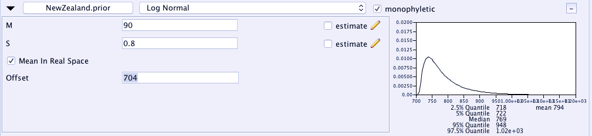 

#### 2. East Polynesian. 

Another good calibration is East Polynesian: it's a well-attested linguistic group, and we have good archaeological evidence for when the initial settlement of East Polynesia began. The ages are a bit controversial between "short" and "long" chronologies e.g.:

    1025-1121 AD =  975-879 years ago (Wilsmhurst et al. '11)
    800-1000 AD  = 1200-1000 years ago (Spriggs '10)

The average of these estimates is about 1000 years ago, and they're spread on both sides by about 150-200 years or so. This makes a great candidate for a `Normal` distribution. Create a new calibration, call it EastPolynesian. Give it a mean of 1000, and a standard deviation ('sigma') of 100.
    
Add the following languages:

~~~
Hawaiian, Mangareva, Maori, Marquesan, RapanuiEasterIsland
Rarotongan, SouthIslandMaori, Tahitian, Tuamotu
~~~    

``[ ] Add the East Polynesian clade.``

## Setting proper priors on everything else.

Finally, we need to make sure the rest of the priors are given proper ranges to constrain them -- i.e. not allow them to be any value from Infinity to Infinity. If we don't these could give us problems later. Open these priors by clicking the button next to them that says `initial = [1.0][-∞,∞]`, and set the `Lower` and `Upper` bounds to a wide range e.g. 0-100.

## MCMC Tab.

Select the `MCMC` tab. This tab controls the analysis length and output files etc. 

`Chain Length` is how long the run will go for (in generations). The default here is 10 million generations but let's change that down to 1 million or you will have to wait a long time. 

``[ ] Change the Chain Length to 1,000,000.``

I want you to change the log file names to something sensible (it will make life easier later).

Open the `tracelog` and `treelog` sections and change the `File Name` to something like "cpacific-ctmc-strict.log" or "cpacific-ctmc-strict.trees".

``[ ] Done.``


## Save the XML file:

1. `File -> Save As`.
2. Make sure you give it a good name e.g. cpacific-ctmc-strict.xml.

``[ ] Make sure you've got the file saved somewhere sensible.``

**IMPORTANT: Don't close BEAUTi, just leave it somewhere -- we'll use it later to set up another analysis and don't want to have to redo everything**.


## Run the Analysis:

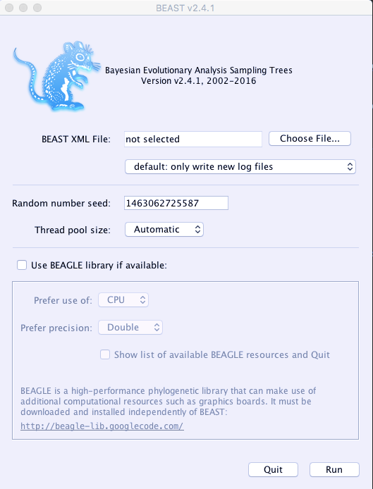 

1. Finally open `BEAST`.
2. Click "Choose File" and feed it the XML file you generated. 
3. Click Run.
4. Wait. 

``[ ] Run BEAST.``


# 3. Understanding BEAST2 Results:


## Process the Analysis:

1. Open `Tracer`. 
2. Drag the log file (cpacific-ctmc-strict.log) into the "Traces" section (or `File-> Import Trace File`). 

### Step 1. Look for unstable traces. 

Because MCMC is a sequential sampling process, we need to worry that our samples are independent enough for our inferences to be statistically robust. 

Look at the ESS column -- this is the `Effective Sample Size`, which measures how independent each sample from the MCMC chain is. We want each one to be large. 

If the ESS is low then it probably means that the parameter is poorly estimated and we shouldn't rely on that parameter: Perhaps the analysis hasn't run long enough, or perhaps we need to put more weight on that parameter in the analysis so it gets modified more often see: <http://beast.bio.ed.ac.uk/increasing-esss>

`Tracer` will highlight anything that's below 200, but for publication you probably want > 1000. In the figure below the ESS for gamma\_shape\_s is slightly low.

``[ ] Look at your data, is there anything with a low ESS?``

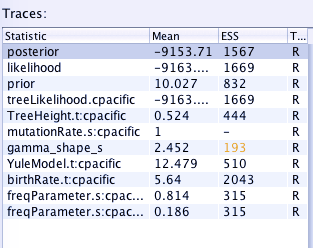 

### Step 2. Inspect the traces.

Click the `Trace` tab and go through all the traces of each parameter/statistic from the analysis. These are plots of that parameter over time in the analysis. You want to make sure they look like "fuzzy caterpillars":

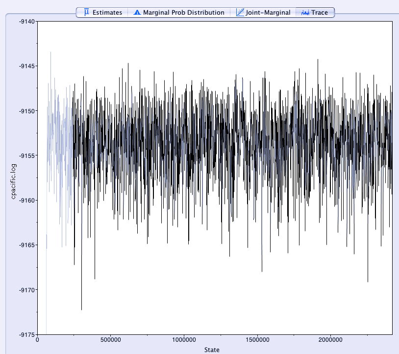 

... that is, they're consistently estimating a parameter value in the same ballpark (here something around -9153), and not trending up or down. 

Here for example, are a couple of bad traces: 

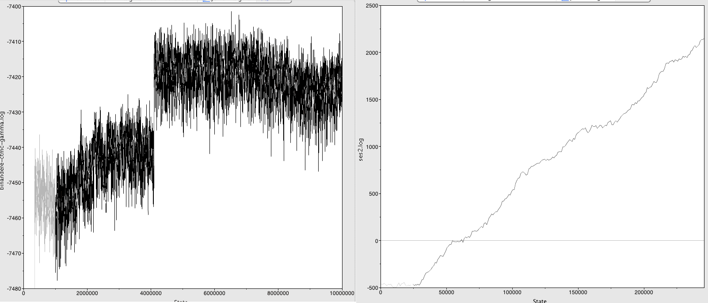 

... The left one shows a jump in the parameter value. To solve this, increase the burn-in to after the jump (>60,000,000 generations here) and hope you've run the analysis long enough to still get good ESSes in the remainder. 

... The right one shows a parameter that's still stabilising. You need to run this analysis a lot longer. Thankfully `BEAST2` can resume analyses so you don't need to start from scratch.

``[ ] Are all your traces ok?``

``[ ] If not, what are some of the problems you can see?``

### Step 3. Check `Estimates`: 

You should also look at the `Estimates` tab for each parameter. This will show a histogram of the parameter which should be unimodal (i.e. not have multiple peaks) and relatively peaked (i.e. not a flat distribution). 

Another key thing to check here is whether the distribution looks truncated at one end. If it is truncated, then the analysis is not allowing that parameter to explore the probability space that it "wants to". There is probably a hard boundary in the analysis from a prior. You should think about relaxing this constraint or removing it to allow the analysis to explore that space properly.

You can also click on the `Estimates` tab to get various statistics about each parameter. 

``[ ] Are all your estimates ok?``

### Step 4. Figure out how much `burn-in`: 

Because of the way MCMC works, we generally start out with terrible parameter estimates based on random guessing and initial settings, and slowly converge towards good estimates (jargon: "reach stationarity"). 

The samples we take from the period before we reach stationarity is called `burn-in`. We want to throw these away as they're not good estimates of the real parameter values.

To identify how much burn-in we need, we look at where the traces all stabilise. A common choice is 10% (it should be the default in Tracer). Is this enough for our data? You can change it in the top left of the Tracer window to try out different amounts.

``[ ] What burn-in do you think is appropriate here?``


### Step 5. Check out interesting parameters:

Let's see how old the age of Eastern Polynesian is. Remember that there's a debate between the 'short' and 'long' chronologies (~800-1000 years vs ~1000-1200 years ago). 

Select the `mrcatime(EastPolynesian)` Parameter and choose the `Estimates` tab. This is the time to the `Most Recent Common Ancestor` (MRCA) of the East Polynesian group.

This will show you the posterior probability distribution of the age of East Polynesian according to these data and model. The key bits of information are the mean and 95% Highest Posterior Density Interval (HPD) -- the Bayesian equivalent of a Confidence Interval. The mean age of Eastern Polynesian is -- in my analysis -- about 1170 years, with a 95% H.P.D. of 1040-1320 years.

Your turn. Let's see how old we are estimating Central Pacific to be. The archaeological record suggests that the settlement of Fiji happened around 3200 B.P. (Nunn et al '04). Select the `TreeHeight` Parameter and choose the `Estimates` tab. 

``[ ] What's the mean age and 95% HPD of Central Pacific?``

``[ ] Is this close to the age of around ~3200 B.P.``


# 4. View the Trees:

Remember that Bayesian phylogenetics produces a posterior tree distribution which contains lots of trees. We can do a couple of things.

## Visualise the entire posterior using Densitree:

A `densitree` (Bouckaert '10) draws each tree in the posterior on top of each other. It's a great way to visualise the whole posterior at once. 

Open the tree in `densitree` (in the `BEAST` folder) and then load the tree file that you generated (e.g. cpacific-ctmc-strict.trees).

Central Pacific is quite a reticulate language zone with lots of dialect chains and borrowing between languages (e.g. Walworth '12, Wilson '12, Salisbury '10, Gray et al '10). We should expect to see some conflicting signal where different trees show support for different groupings. 

``[ ] What regions of high conflicting signal are there?``


## Construct a summary "maximum clade credibility tree":

The M.C.C. Tree is a good _single_ tree representation of the posterior. Here we calculate the product of all the clade probabilities on each tree in the posterior to find the 'best' one. See <http://beast.bio.ed.ac.uk/summarizing-posterior-trees>.

1. Open `TreeAnnotator`
2. Set `Burn-in Percentage` to 10 (percent) or whatever you thought appropriate from the `Tracer` results.
3. Select `Input Tree File` by clicking 'Choose File' and select your tree file (cpacific-ctmc-strict.trees)
4. Select the `Output File` by clicking 'Choose File' and typing a good file name for the resulting trees in. Personally I'd choose something like "cpacific-ctmc-strict.mcct.trees". 
5. Make the MCC tree.

``[ ] Successfully make an MCC Tree``

Open this file in `FigTree`. Because this is a Bayesian analysis with time-dated trees, let's turn on a few options.

1. Click the checkbox by `scale axis` to turn on a time-scale.
2. Turn on Node Labels. Open the `Node Labels` section on the left
3. Click the check box
4. Change the `Display` value to `posterior`. 
5. Change `Sig. Digits` to 2 to make it easier to read.

These values give us the number of times each of the subgroups was found in all trees in the posterior. It is the strength of support, in these data, given this model, for that subgrouping. We want high numbers -- A value of 1.00 means that this subgrouping was always found. Anything below about 0.7 is weak.

``[ ] What subgroups have very high support (=1.00)``

``[ ] Are there subgroups with low support (<0.70)``

Remember that in our data exploration we saw that S.I. Maori, Nukuoro, and East Uvea had a lot of missing data. 

``[ ] Do S.I. Maori, Nukuoro, and East Uvea behave here, or should we remove them?``


What visualisation should you prefer? It all depends on how well attested your trees are and how much conflicting signal there is.  Densitree shows you everything, but by showing you everything it can be hard to see the forest for the trees. On the other hand, the MCC tree shows the majority signal but loses all the more complex history (and is prone to be misinterpreted if you don't read the probability scores too). As always, don't rely on one tree. If you go on to use comparative methods or do other subsequent things with your trees, make sure you do it across **all** the trees in the posterior and not just one. 

## Your Turn (if we have time): 

Go back to BEAUTi (remember that you left it running, right?) and change the clock model to a relaxed clock (log normal). 

Make sure you change the `tracelog` and `treelog` filenames on the `MCMC` tab to something like `cpacific-ctmc-relaxed.log` and `cpacific-ctmc-relaxed.trees`. 

``[ ] Generate an XML for the relaxed clock analysis``

``[ ] Run the relaxed clock analysis``

If you have time, you could try setting up a _covarion_ analysis. The Covarion is a nice model that allows each cognate in our data to switch 'on' and 'off' at different points on the tree (Penny et al. '01). It's often found to be the *best* fitting model for language data in my experience.

To do this, use the `BinaryCovarion` template in `BEAUTi` rather than `BinaryCTMC`, and ask me for tips. 

# 5. Comparing Analyses:

We should now have two completed analyses -- cpacific-ctmc-relaxed and cpacific-ctmc-strict. If you haven't gotten this far, then use the analyses from the downloaded file.

``[ ] Make sure you have both analyses``

Open `Tracer` and load both log files from these two analyses into it.

``[ ] Load both log files into Tracer``

### Comparing parameter estimates across analyses:

`Tracer` allows us to compare across different analyses quite easily. Let's look at the estimate age of these languages again:

1. Select both trace files in the `Trace Files` panel (top left)
2. Select the `TreeHeight` parameter in the `Traces` panel (on the left).
3. Look on the `Estimates` tab -- you should see the vital statistics of both analyses for this parameter. 

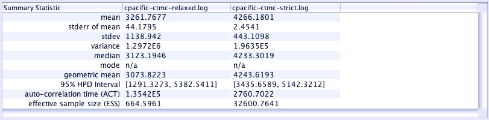 


``[ ] Which analysis is closer to our expected age of ~3200?``

4. Select the `Marginal Prob. Distribution` tab.
5. Down the bottom of the screen turn on the `Legend`, and then set `Color By` to `Trace file`. 

``[ ] What are the differences/similarities between the two estimated ages?``

###  Which analysis is best?

As a rule of thumb, the analysis with the smallest value for `posterior` (closer to zero) is better.

``[ ] Which analysis is better?``

But it's better if we use a formal model testing procedure to find which analysis is the best for these data. The easiest method at the moment is to calculate the `AICM` (Akaike Information Criteria through MCMC). The model with the _lowest_ AICM is better, and differences in AICM scores > 7 provide `strong evidence` of one model over the other (Burnham & Anderson '98).

**Note** The AICM does not tell you that a model is *correct*, just that it is a better fit to the data. 

To do this, in `Tracer` select `Analysis -> Model Comparison` from the file menu. Then make sure that `likelihood` and `aicm` are selected. 

Calculating the AICM takes forever. If you were going to publish the results then you should make sure that `Bootstrap replicates` is set to 1000 so you get a good estimate. However, for our case we're going to set it to 5.

Here's the results from an analysis I ran earlier a while ago on `Uto-Aztecan` languages. Note that the first analysis (ua-covarion-gamma-relaxed) has a lower AICM than the other one by 38.444 units. This is substantial support for the first analysis being a better fit to the data.

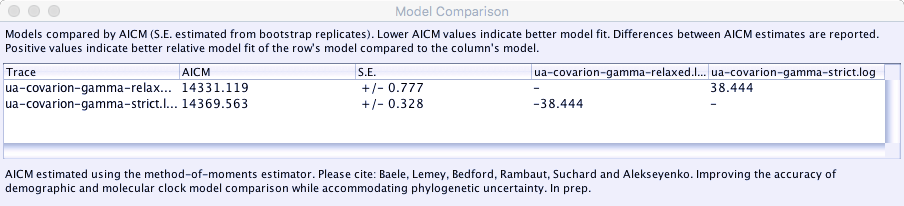 

Run the AICM on your data:

``[ ] Which analysis is better?``

``[ ] By how much?``


The AICM is the simplest way to compare models at the moment, but the current gold standard (as of last month) is an approach called `Nested Sampling` but it needs more work and can take a bit of time to run. For publication you should run a Nested Sampling following this tutorial: <https://github.com/BEAST2-Dev/nested-sampling>


# 6. Subgrouping of Polynesian Languages:

It turns out that there's a recent debate about how the Polynesian languages are sub-grouped. For a long time the accepted classification of these languages has followed Andy Pawley ('66, '67) with some revisions by Jeff Marck ('00).

This is what the Pawley-Marck classification looks like:

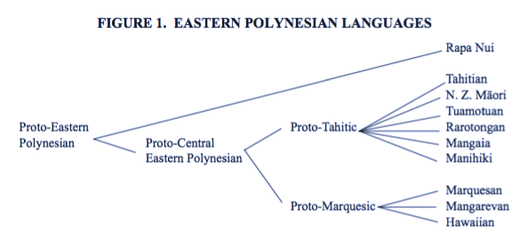 

However, a more recent study by Mary Walworth ('14) has argued that the evidence for both `Proto-Tahitic` and `Proto-Marquesan` is weak and we'd be better off with this picture:

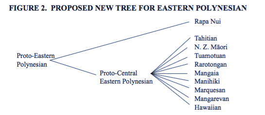 

In our results we have the following Tahitic languages:

* Tahitian, Maori, SouthIslandMaori, Tuamotuan, and Rarotongan.

... and the Marquesic languages: 

* Marquesan, Mangarevan, and Hawaiian.


Our results from the best fitting model say this:

``[ ] Which hypothesis do we support?``

TODO: CHECK AND UPDATE.

 

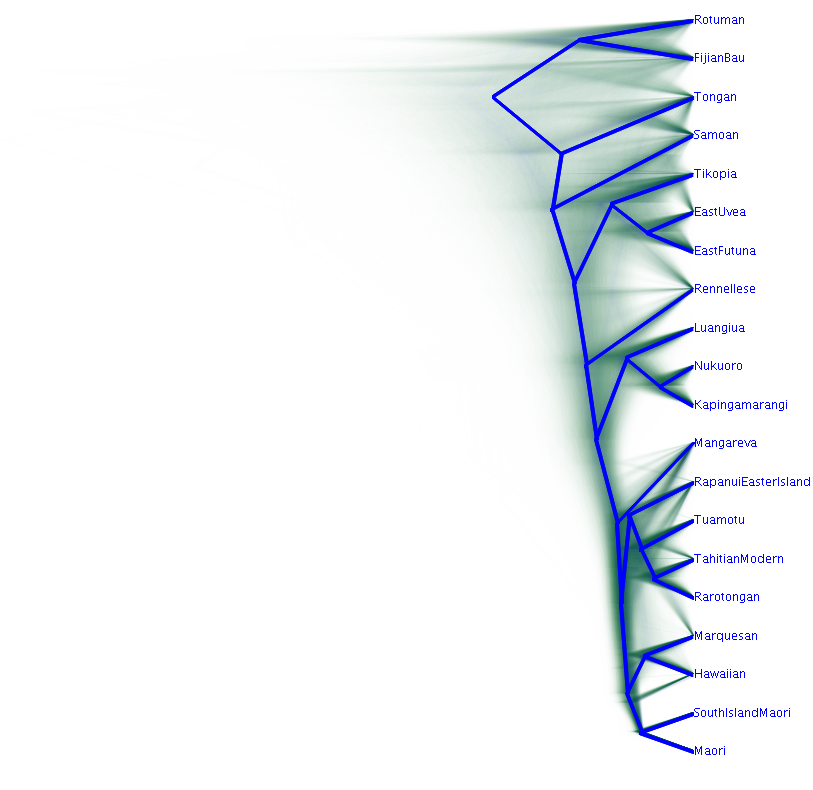 


# Conclusions:

I hope to have shown you how to:

* do some quality control checks on your data
* visualise data and interpret a Neighbor-Net
* set up a phylogenetic analysis to estimate some trees
* process this analysis to check for stability.
* make inferences about timing of Pacific settlement
* make inferences about the subgrouping of these languages.

# Discussion:

1. here we've applied these methods to reasonably messy set of languages -- lots of dialect chains and language contact. Do you think it worked? Was I too optimistic? When is it not appropriate to use these methods?

2. how could we make these methods better?

3. what about *your* data. Are there any questions that phylogenetic tools can help you answer? 

**More Resources:** The Taming the BEAST website is amazing (https://taming-the-beast.org/), and the BEAST2 blog is frequently updated with new mini-tutorials (http://www.beast2.org/). The canonical reference guide is the BEAST book (https://www.beast2.org/book/).

# Appendix. Ascertainment Correction.

One problem with most linguistic and cultural data is that researchers tend not to collect data that doesn't vary. This is a form of _sampling bias_ called _ascertainment bias_. Ascertainment bias is a problem as it will cause the analyses to substantially over-estimated branch-lengths as only variable sites are in the data (Lewis '01). This over-estimation will have flow-on effects to rate and age estimates, and may influence the tree topology too. This really does matter.

How do we deal with it? `BEAST 2` thankfully has a correction built into the likelihood calculation, and the language templates in `Babel` are set up to use it automatically. **However** you must do one thing to your data: add a single character at the start of the nexus file that is all zero and `BEAST 2` will correct the likelihood appropriately e.g.:

~~~
#NEXUS

BEGIN DATA;
    DIMENSIONS NTAX=3 NCHAR=1;
    FORMAT DATATYPE=STANDARD MISSING=? GAP=-  SYMBOLS="01";

MATRIX
English    0(.....etc)
French     0(.....etc)
German     0(.....etc)
;
END;
~~~


# References

* Archie, J. W. (1989). A randomization test for phylogenetic information in systematic data. Systematic Biology, 38(3), 239.
* Baele, G., Lemey, P., Bedford, T., Rambaut, A., Suchard, M. a., & Alekseyenko, A. V. (2012). Improving the accuracy of demographic and molecular clock model comparison while accommodating phylogenetic uncertainty. Molecular Biology and Evolution, 29(9), 2157–2167.
* Bouckaert, R., Heled, J., Kühnert, D., Vaughan, T., Wu, C-H., Xie, D., Suchard, MA., Rambaut, A., & Drummond, A. J. (2014). BEAST 2: A Software Platform for Bayesian Evolutionary Analysis. PLoS Computational Biology, 10(4), e1003537. 
* Bouckaert, R. R. (2010). DensiTree: making sense of sets of phylogenetic trees. Bioinformatics (Oxford, England), 26(10), 1372–3. 
* Bouckaert, R. R., Lemey, P., Dunn, M., Greenhill, S. J., Alekseyenko, A. V, Drummond, A. J., Gray, R. D., Suchard, M. A., & Atkinson, Q. D. (2012). Mapping the Origins and Expansion of the Indo-European Language Family. Science, 337(6097), 957–960.
* Bryant, D., & Moulton, V. (2002). NeighborNet: An agglomerative method for the construction of planar phylogenetic networks. Algorithms in Bioinformatics, 375–391. 
* Burnham, K. P., & Anderson, D. R. (1998). Model selection and multimodel inference: A practical information-theoretic approach. New York: Springer.
* Drummond, A. J., Ho, S. Y. W., Phillips, M. J., & Rambaut, A. (2006). Relaxed phylogenetics and dating with confidence. PLOS Biology, 4(5), e88.
* Drummond A. J. & Bouckaert R. R. (2015). Bayesian evolutionary analysis with BEAST. Cambridge University Press: Cambridge.
* Gray, R. D., Bryant, D., & Greenhill, S. J. (2010). On the shape and fabric of human history. Philosophical Transactions of the Royal Society of London. Series B, Biological Sciences, 365(1559), 3923–33. 
* Hillis, D. M., & Huelsenbeck, J. P. (1992). Signal, noise, and reliability in molecular phylogenetic analyses. Journal of Heredity, 83, 189–195.
* Lewis P.O. (2001) A likelihood approach to estimating phylogeny from discrete morphological character data. Systematic Biology, 50:913–925.
* Marck, J. (2000). Topics in Polynesian language and culture history. Canberra: Pacific Linguistics.
* Nunn, P. D. et al. (2004). Early Lapita settlement site at Bourewa, southwest Viti Levu Island, Fiji. Archaeology in Oceania, 39(3), 139–144. 
* Pawley, A. (1966). Polynesian Languages: A subgrouping based on shared innovations in morphology. Journal of the Polynesian Society, 75(1), 39-64.
* Pawley, A. (1967). The relationships of Polynesian Outlier languages. Journal of the Polynesian Society, 76(3), 1-29.
* Penny, D., McComish, B. J., Charleston, M. A., & Hendy, M. D. (2001). Mathematical elegance with biochemical realism: the covarion model of molecular evolution. Journal of Molecular Evolution, 53(6), 711–723.
* Revell, L. J., Harmon, L. J., & Collar, D. C. (2008). Phylogenetic signal, evolutionary process, and rate. Systematic Biology, 57(4), 591–601.
* Spriggs, M. (2010). I was so much older then, I'm younger than that now: why the dates keep changing for the spread of Austronesian languages. In J. Bowden, N. P. Himmelmann, & M. D. Ross (Eds.), A journey through Austronesian and Papuan linguistic and cultural space: Papers in honour of Andrew Pawley (pp. 113-140). Canberra: Pacific Linguistics.
* Tavaré S. (1986). Some Probabilistic and Statistical Problems in the Analysis of DNA Sequences. Lectures on Mathematics in the Life Sciences, 17: 57–86.
* Walworth, M. (2012). Eastern Polynesian: The Linguistic Evidence Revisited. Oceanic Linguistics, 43, 256–272.
* Wiens, J. J. (2006). Missing data and the design of phylogenetic analyses. Journal of Biomedical Informatics, 39(1), 34–42. 
* Wilmshurst, J. M., Hunt, T. L., Lipo, C. P., & Anderson, A. J. (2011). High-precision radiocarbon dating shows recent and rapid initial human colonization of East Polynesia. Proceedings of the National Academy of Sciences of the United States of America, 108(5), 1815-1820.
* Wilson, W. H. (2012). Whence the East Polynesians?: Further Linguistic Evidence for a Northern Outlier Source. Oceanic Linguistics, 51(2), 289–359. 
* Yang, Z. (1993). Maximum-Likelihood Estimation of Phylogeny from DNA Sequences When Substitution Rates Differ over Sites. Molecular Biology and Evolution, 10(6), 1396–1401.
* Yule, G. U. (1924). A mathematical theory of evolution, based on the conclusions of Dr. J. C. Willis, F.R.S. Philosophical Transactions of the Royal Society of London. Series B, Biological Sciences, 213, 21–87.
